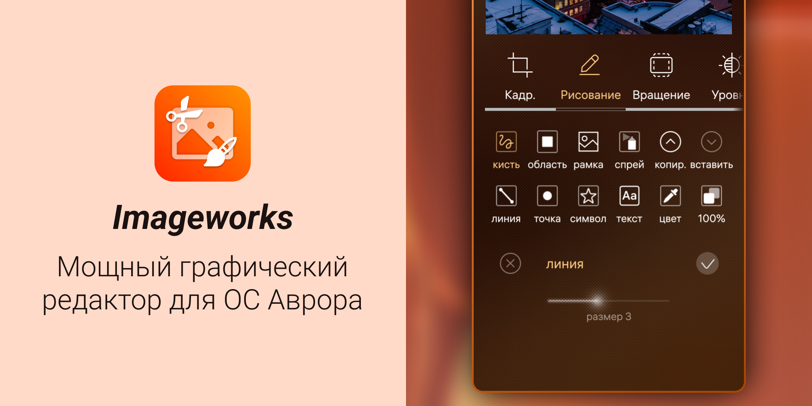

Imageworks - наиболее продвинутый редактор фото для ОС Аврора, который вы видели. Он содержит большое количество функций, эффектов и инструментов для редактирования.

Imageworks основывается на одноименном приложении для Sailfish OS и использует библиотеку Python Pillow. 

| Ссылки для скачивания |
| --- |
| 🛒 [Аврора Маркет](https://aurorarepos.ru/aurora-5/imageworks) <br> 😼 [Скачать RPM](https://github.com/salty-smoothie/aurora-imageworks/releases/latest/) |

## Функционал

- Кадрирование
  - Обрезка (свободная или один из 12 пресетов)
  - Растягивание (к углам или от углов)
- Рисование
  - Кисть
  - Область
  - Рамка
  - Спрей (баллончик с краской)
  - Копирование и вставка
  - Линия
  - Точка (круг произвольного размера)
  - Фигура
  - Текст
  - Пипетка
- Вращение на произвольный угол и отражение по осям
- Уровни
  - Яркость
  - Контраст
  - Цвет
  - Резкость
  - HUE (цветовой круг)
- Изменение размера холста и изображения
- Тулбокс
  - Продвинутое редактирование пикселей
  - Управление цветовыми каналами
  - Управление цветом на гистограмме
  - Фильтры из LUT (пресеты или кастомный файл)
  - Множество эффектов с возможностью предварительного просмотра
  - Инструмент для создания коллажей
- Работа с файлом
  - Удалить, переименовать
  - Просмотр мета-данных
  - Создание нового изображения 
- Сохранение в форматах JPG, PNG, GIF, BMP, простой и многостраничный PDF

## Поддержка и предложения

Если у вас возникли проблемы или появились вопросы, создайте пост в [GitHub Issues](https://github.com/salty-smoothie/aurora-imageworks/issues) этого репозитория.

Вы также можете поддержать автора порта для ОС Аврора монетой на [Boosty](https://boosty.to/smooth-e/donate).

Мы будем рады, если вы поддержите проект, предложив свои  изменения или исправления. Сборка проекта осуществляется при помощи [Aurora Platform SDK](https://developer.auroraos.ru/doc/sdk/psdk/setup_script) на Linux или внутри WSL. Мы не тестировали возможность сборки в других конфигурациях.

Для сборки проекта необходимо выполнить следующие шаги:

1. Клонируйте этот репозиторий и сабмодули:
   ```sh
   git clone https://github.com/salty-smoothie/aurora-imageworks --recurse-submodules && cd aurora-imageworks
   ```
2. Примените патчи для библиотек:
   ```sh
   git apply libs/*.patch
   ```
3. Соберите библиотеки, поставляемые вместе с приложением. Это будет необходимо сделать хотя бы один раз для каждой целевой архитектуры.
   ```sh
   aurora_psdk ./prepare.sh -t  AuroraOS-5.1.5.105-MB2-aarch64
   ```
   Вы можете узнать о работе скрипта подробнее, выполнив `./prepare -h`. Скрипт позволяет собирать библиотеки по-отдельности или включить дополнительные оптимизации для них.
4. Соберите, запакуйте и установите приложение [стандартными средствами Aurora Platform SDK](https://developer.auroraos.ru/doc/sdk/psdk/build).

## Авторы

- Copyright (C) 2026 Smooth-E <smoothie@disroot.org>
  <br>Автор и мейнтенер порта Imageworks для ОС Аврора
- Copyright (C) 2021-2023 Mark Washeim <blueprint@poetaster.de>
  <br>Мейнтейнер [форка оригинального приложения](https://github.com/poetaster/harbour-simplecrop) для Sailfish OS
- Copyright (C) 2020 Tobias Planitzer <tobias.planitzer@protonmail.com>
  <br>Автор оригинального приложения для Sailfish OS
